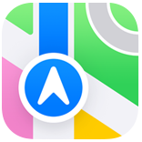
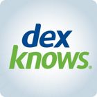
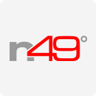
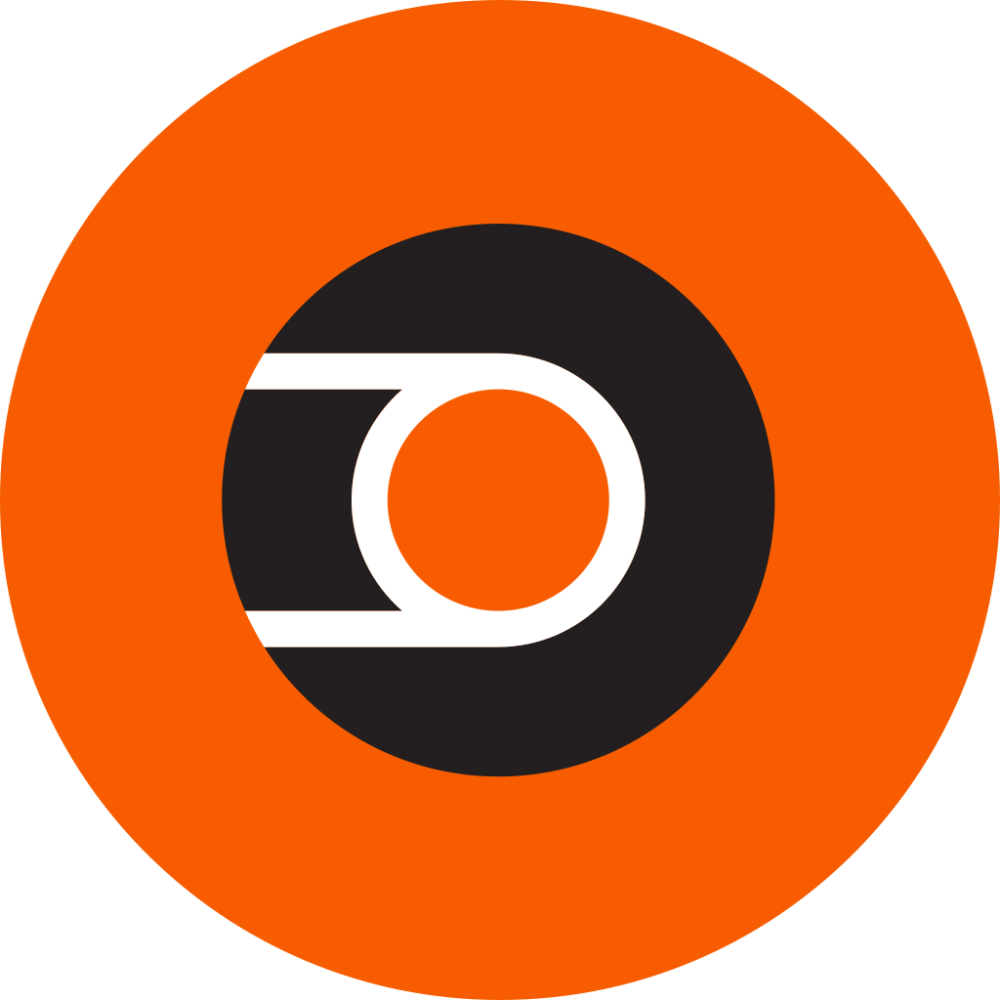
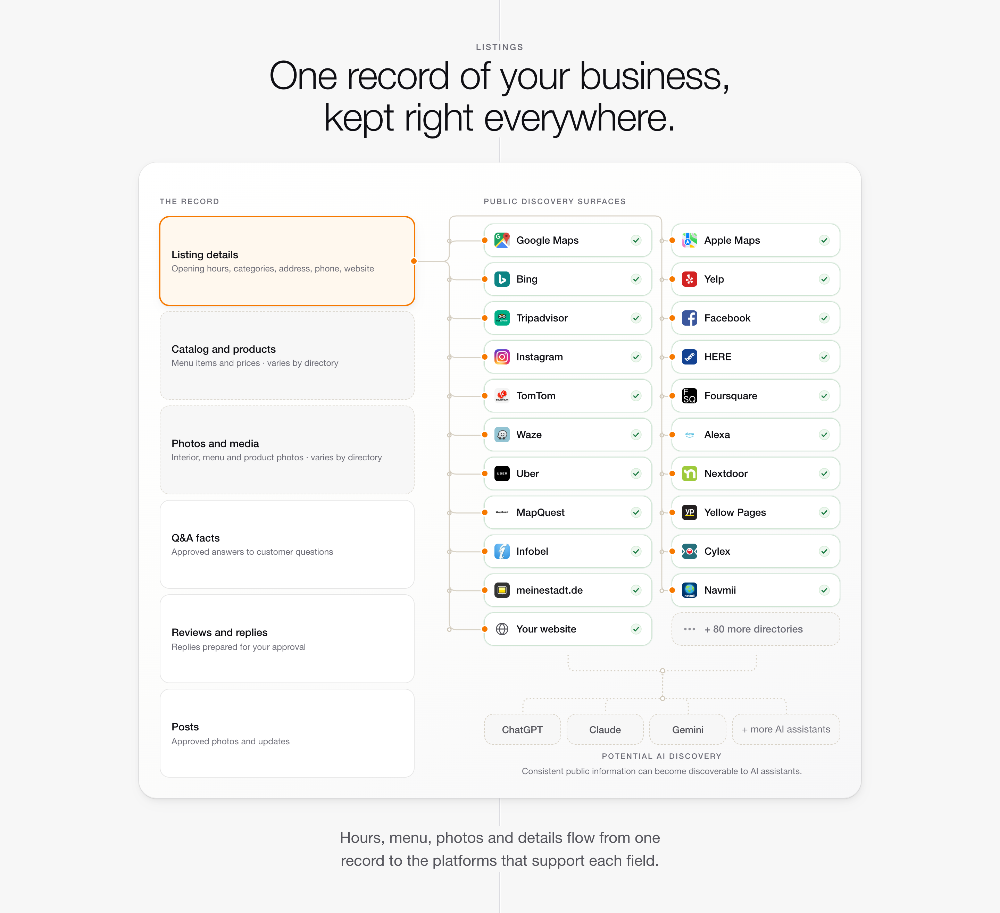

# Directory roster

All 104 destinations in Obenan's roster, from A to Z, with their logos. The live
[Directories and platforms](https://www.obenan.ai/directories-and-platforms/) page is the source of truth; this mirror was
checked against it on 9 October 2026 (website commit `ea406d3`). Machine-readable copy:
[`directories.json`](directories.json). Logo files and provenance:
[`assets/directory-logos`](../../assets/directory-logos/README.md).

## How to say it

- **104 destinations in the roster.** 90 are sent by interface and 14 by export. 4 are marked inactive in the roster.
- Interface and export describe how a destination receives information in Obenan's records:
  through a software interface, to the destination or to the record it shares, or as an export
  file that the destination or a distributor imports. Neither means a separate connection, and
  neither confirms coverage for a specific location.
- Reading and replying are separate abilities. We confirm which destinations apply, and what
  each one supports, for each business's locations. Do not quote per-platform review, reply,
  question or post counts; the website no longer publishes them.
- Link a prospect to the live roster or a platform guide below rather than pasting this list.
  The [machine-readable capability map](https://www.obenan.ai/for-agents/) is the agent-facing source.

## Platform guides

- [Google](https://www.obenan.ai/directories-and-platforms/google/)
- [Apple Maps](https://www.obenan.ai/directories-and-platforms/apple-maps/)
- [Bing](https://www.obenan.ai/directories-and-platforms/bing/)
- [Yelp](https://www.obenan.ai/directories-and-platforms/yelp/)
- [Facebook](https://www.obenan.ai/directories-and-platforms/facebook/)
- [Tripadvisor](https://www.obenan.ai/directories-and-platforms/tripadvisor/)
- [Cylex and Find Open](https://www.obenan.ai/directories-and-platforms/cylex/)

## A to Z

Each name links to its letter in the live roster.

### A

| Logo | Destination | Connection | Notes |
|---|---|---|---|
|  | [Acompio](https://www.obenan.ai/directories-and-platforms/#roster-A) | Sent by interface |  |
|  | [Alexa](https://www.obenan.ai/directories-and-platforms/#roster-A) | Sent by export |  |
|  | [Annuaire](https://www.obenan.ai/directories-and-platforms/#roster-A) | Sent by interface |  |
|  | [Apple Maps](https://www.obenan.ai/directories-and-platforms/#roster-A) | Sent by interface | [Guide](https://www.obenan.ai/directories-and-platforms/apple-maps/) |
|  | [Audi](https://www.obenan.ai/directories-and-platforms/#roster-A) | Sent by interface |  |
|  | [Auskunft](https://www.obenan.ai/directories-and-platforms/#roster-A) | Sent by interface |  |

### B

| Logo | Destination | Connection | Notes |
|---|---|---|---|
|  | [BBB](https://www.obenan.ai/directories-and-platforms/#roster-B) | Sent by export |  |
|  | [Bing](https://www.obenan.ai/directories-and-platforms/#roster-B) | Sent by interface | [Guide](https://www.obenan.ai/directories-and-platforms/bing/) |
|  | [BMW](https://www.obenan.ai/directories-and-platforms/#roster-B) | Sent by interface |  |
|  | [Bonial France](https://www.obenan.ai/directories-and-platforms/#roster-B) | Sent by interface |  |
|  | [Branchenbuch Deutschland](https://www.obenan.ai/directories-and-platforms/#roster-B) | Sent by interface |  |
|  | [Business Branchenbuch](https://www.obenan.ai/directories-and-platforms/#roster-B) | Sent by interface |  |
|  | [Busqueda Local](https://www.obenan.ai/directories-and-platforms/#roster-B) | Sent by interface |  |

### C

| Logo | Destination | Connection | Notes |
|---|---|---|---|
|  | [Central Index](https://www.obenan.ai/directories-and-platforms/#roster-C) | Sent by interface |  |
|  | [Chamber of Commerce](https://www.obenan.ai/directories-and-platforms/#roster-C) | Sent by interface |  |
|  | [Citipages](https://www.obenan.ai/directories-and-platforms/#roster-C) | Sent by interface | Shares the Central Index record |
|  | [City Squares](https://www.obenan.ai/directories-and-platforms/#roster-C) | Sent by interface |  |
|  | [Citysearch](https://www.obenan.ai/directories-and-platforms/#roster-C) | Sent by export |  |
|  | [Consumer Affairs](https://www.obenan.ai/directories-and-platforms/#roster-C) | Sent by interface |  |
|  | [Credit Karma](https://www.obenan.ai/directories-and-platforms/#roster-C) | Sent by interface |  |
|  | [Cylex](https://www.obenan.ai/directories-and-platforms/#roster-C) | Sent by interface | [Guide](https://www.obenan.ai/directories-and-platforms/cylex/) |

### D

| Logo | Destination | Connection | Notes |
|---|---|---|---|
|  | [Delivery](https://www.obenan.ai/directories-and-platforms/#roster-D) | Sent by interface |  |
|  | [DexKnows](https://www.obenan.ai/directories-and-platforms/#roster-D) | Sent by interface | Shares the Yellow Pages record |
|  | [Doctor.com](https://www.obenan.ai/directories-and-platforms/#roster-D) | Sent by interface |  |

### E

| Logo | Destination | Connection | Notes |
|---|---|---|---|
|  | [eLocal](https://www.obenan.ai/directories-and-platforms/#roster-E) | Sent by interface |  |
|  | [EZlocal](https://www.obenan.ai/directories-and-platforms/#roster-E) | Sent by interface |  |

### F

| Logo | Destination | Connection | Notes |
|---|---|---|---|
|  | [Facebook](https://www.obenan.ai/directories-and-platforms/#roster-F) | Sent by interface | [Guide](https://www.obenan.ai/directories-and-platforms/facebook/) |
|  | [Fiat](https://www.obenan.ai/directories-and-platforms/#roster-F) | Sent by interface |  |
|  | [Find Open](https://www.obenan.ai/directories-and-platforms/#roster-F) | Sent by interface | Shares the Cylex record; [Guide](https://www.obenan.ai/directories-and-platforms/cylex/) |
|  | [Ford](https://www.obenan.ai/directories-and-platforms/#roster-F) | Sent by interface |  |
|  | [Foursquare](https://www.obenan.ai/directories-and-platforms/#roster-F) | Sent by export |  |

### G

| Logo | Destination | Connection | Notes |
|---|---|---|---|
|  | [Glassdoor](https://www.obenan.ai/directories-and-platforms/#roster-G) | Sent by interface |  |
|  | [GM](https://www.obenan.ai/directories-and-platforms/#roster-G) | Sent by interface |  |
|  | [GoLocal](https://www.obenan.ai/directories-and-platforms/#roster-G) | Sent by interface |  |
|  | [Google](https://www.obenan.ai/directories-and-platforms/#roster-G) | Sent by export | [Guide](https://www.obenan.ai/directories-and-platforms/google/) |
|  | [Google Assistant](https://www.obenan.ai/directories-and-platforms/#roster-G) | Sent by export | Shares the Google record |
|  | [Google Maps](https://www.obenan.ai/directories-and-platforms/#roster-G) | Sent by export | Shares the Google record |
|  | [Google Play](https://www.obenan.ai/directories-and-platforms/#roster-G) | Sent by interface |  |
|  | [GoYellow](https://www.obenan.ai/directories-and-platforms/#roster-G) | Sent by interface |  |
|  | [Grubhub](https://www.obenan.ai/directories-and-platforms/#roster-G) | Sent by interface |  |

### H

| Logo | Destination | Connection | Notes |
|---|---|---|---|
|  | [HERE](https://www.obenan.ai/directories-and-platforms/#roster-H) | Sent by export |  |
|  | [Hotfrog](https://www.obenan.ai/directories-and-platforms/#roster-H) | Sent by interface |  |
|  | [Huawei](https://www.obenan.ai/directories-and-platforms/#roster-H) | Sent by interface |  |

### I

| Logo | Destination | Connection | Notes |
|---|---|---|---|
|  | [iGlobal](https://www.obenan.ai/directories-and-platforms/#roster-I) | Sent by interface |  |
|  | [Indeed](https://www.obenan.ai/directories-and-platforms/#roster-I) | Sent by interface |  |
|  | [Infobel](https://www.obenan.ai/directories-and-platforms/#roster-I) | Sent by interface |  |
|  | [InfoGroup](https://www.obenan.ai/directories-and-platforms/#roster-I) | Sent by interface |  |
|  | [InfoIsInfo](https://www.obenan.ai/directories-and-platforms/#roster-I) | Sent by interface |  |
|  | [Insider Pages](https://www.obenan.ai/directories-and-platforms/#roster-I) | Sent by export | Shares the Citysearch record |
|  | [Instagram](https://www.obenan.ai/directories-and-platforms/#roster-I) | Sent by interface |  |

### J

| Logo | Destination | Connection | Notes |
|---|---|---|---|
|  | [Judy's Book](https://www.obenan.ai/directories-and-platforms/#roster-J) | Sent by interface |  |

### K

| Logo | Destination | Connection | Notes |
|---|---|---|---|
|  | [Koomio](https://www.obenan.ai/directories-and-platforms/#roster-K) | Sent by interface |  |

### L

| Logo | Destination | Connection | Notes |
|---|---|---|---|
|  | [LendingTree](https://www.obenan.ai/directories-and-platforms/#roster-L) | Sent by interface |  |
|  | [LinkedIn](https://www.obenan.ai/directories-and-platforms/#roster-L) | Sent by interface |  |
|  | [Liverpool Echo](https://www.obenan.ai/directories-and-platforms/#roster-L) | Sent by interface | Shares the Central Index record |

### M

| Logo | Destination | Connection | Notes |
|---|---|---|---|
|  | [Manta](https://www.obenan.ai/directories-and-platforms/#roster-M) | Sent by interface |  |
|  | [MapQuest](https://www.obenan.ai/directories-and-platforms/#roster-M) | Sent by interface |  |
|  | [Marktplatz Mittelstand](https://www.obenan.ai/directories-and-platforms/#roster-M) | Sent by interface |  |
|  | [meinestadt.de](https://www.obenan.ai/directories-and-platforms/#roster-M) | Sent by interface |  |
|  | [Meinungsmeister](https://www.obenan.ai/directories-and-platforms/#roster-M) | Sent by interface | Shares the GoLocal record |
|  | [My Local Services](https://www.obenan.ai/directories-and-platforms/#roster-M) | Sent by interface |  |

### N

| Logo | Destination | Connection | Notes |
|---|---|---|---|
|  | [N49](https://www.obenan.ai/directories-and-platforms/#roster-N) | Sent by interface |  |
|  | [Navmii](https://www.obenan.ai/directories-and-platforms/#roster-N) | Sent by interface |  |
|  | [Nextdoor](https://www.obenan.ai/directories-and-platforms/#roster-N) | Sent by export |  |
|  | [NPPES](https://www.obenan.ai/directories-and-platforms/#roster-N) | Sent by interface | Shares the Doctor.com record |

### O

| Logo | Destination | Connection | Notes |
|---|---|---|---|
|  | [Oeffnungszeitenbuch](https://www.obenan.ai/directories-and-platforms/#roster-O) | Sent by interface |  |
|  | [OpenTable](https://www.obenan.ai/directories-and-platforms/#roster-O) | Sent by interface |  |
|  | [OpenTable USA](https://www.obenan.ai/directories-and-platforms/#roster-O) | Sent by interface |  |
|  | [OPIS EV](https://www.obenan.ai/directories-and-platforms/#roster-O) | Sent by interface | Shares the Eco Movement record |

### P

| Logo | Destination | Connection | Notes |
|---|---|---|---|
|  | [Pages24](https://www.obenan.ai/directories-and-platforms/#roster-P) | Sent by interface |  |
|  | [Pratique](https://www.obenan.ai/directories-and-platforms/#roster-P) | Sent by interface |  |

### R

| Logo | Destination | Connection | Notes |
|---|---|---|---|
|  | [Ricercare Imprese](https://www.obenan.ai/directories-and-platforms/#roster-R) | Sent by interface |  |

### S

| Logo | Destination | Connection | Notes |
|---|---|---|---|
|  | [Scoot](https://www.obenan.ai/directories-and-platforms/#roster-S) | Sent by interface | Shares the Central Index record |
|  | [ShowMeLocal](https://www.obenan.ai/directories-and-platforms/#roster-S) | Sent by interface |  |
|  | [Siri](https://www.obenan.ai/directories-and-platforms/#roster-S) | Sent by interface | Shares the Apple Maps record |
|  | [Stadtbranchenbuch](https://www.obenan.ai/directories-and-platforms/#roster-S) | Sent by interface |  |
|  | [Superpages](https://www.obenan.ai/directories-and-platforms/#roster-S) | Sent by interface | Shares the Yellow Pages record |

### T

| Logo | Destination | Connection | Notes |
|---|---|---|---|
|  | [The Daily Record](https://www.obenan.ai/directories-and-platforms/#roster-T) | Sent by interface | Shares the Central Index record |
|  | [The Evening Standard](https://www.obenan.ai/directories-and-platforms/#roster-T) | Sent by interface | Shares the Central Index record |
|  | [The Mirror](https://www.obenan.ai/directories-and-platforms/#roster-T) | Sent by interface | Shares the Central Index record |
|  | [The Scotsman](https://www.obenan.ai/directories-and-platforms/#roster-T) | Sent by interface | Shares the Central Index record |
|  | [TomTom](https://www.obenan.ai/directories-and-platforms/#roster-T) | Sent by export |  |
|  | [TomTom EV](https://www.obenan.ai/directories-and-platforms/#roster-T) | Sent by interface | Shares the Eco Movement record |
|  | [TouchLocal](https://www.obenan.ai/directories-and-platforms/#roster-T) | Sent by interface | Shares the Central Index record |
|  | [Toyota](https://www.obenan.ai/directories-and-platforms/#roster-T) | Sent by interface | Inactive in the roster |
|  | [Tripadvisor](https://www.obenan.ai/directories-and-platforms/#roster-T) | Sent by export | [Guide](https://www.obenan.ai/directories-and-platforms/tripadvisor/) |
|  | [Trustpilot](https://www.obenan.ai/directories-and-platforms/#roster-T) | Sent by interface | Inactive in the roster |
|  | [Tupalo](https://www.obenan.ai/directories-and-platforms/#roster-T) | Sent by interface |  |

### U

| Logo | Destination | Connection | Notes |
|---|---|---|---|
|  | [Uber](https://www.obenan.ai/directories-and-platforms/#roster-U) | Sent by export |  |
|  | [Unternehmensauskunft](https://www.obenan.ai/directories-and-platforms/#roster-U) | Sent by interface | Shares the Business Branchenbuch record |
|  | [US City](https://www.obenan.ai/directories-and-platforms/#roster-U) | Sent by interface |  |
|  | [USInfo.com](https://www.obenan.ai/directories-and-platforms/#roster-U) | Sent by interface |  |

### V

| Logo | Destination | Connection | Notes |
|---|---|---|---|
|  | [VW](https://www.obenan.ai/directories-and-platforms/#roster-V) | Sent by interface | Inactive in the roster |

### W

| Logo | Destination | Connection | Notes |
|---|---|---|---|
|  | [WalletHub](https://www.obenan.ai/directories-and-platforms/#roster-W) | Sent by interface |  |
|  | [Waze](https://www.obenan.ai/directories-and-platforms/#roster-W) | Sent by export | Shares the Google record |
|  | [WhatsApp](https://www.obenan.ai/directories-and-platforms/#roster-W) | Sent by interface | Inactive in the roster |
|  | [Where To](https://www.obenan.ai/directories-and-platforms/#roster-W) | Sent by interface |  |
|  | [Wo Gibts Was](https://www.obenan.ai/directories-and-platforms/#roster-W) | Sent by interface |  |

### Y

| Logo | Destination | Connection | Notes |
|---|---|---|---|
|  | [Yellow Pages](https://www.obenan.ai/directories-and-platforms/#roster-Y) | Sent by interface |  |
|  | [Yellow Pages Canada](https://www.obenan.ai/directories-and-platforms/#roster-Y) | Sent by interface |  |
|  | [Yelp](https://www.obenan.ai/directories-and-platforms/#roster-Y) | Sent by interface | [Guide](https://www.obenan.ai/directories-and-platforms/yelp/) |

### Z

| Logo | Destination | Connection | Notes |
|---|---|---|---|
|  | [Zillow](https://www.obenan.ai/directories-and-platforms/#roster-Z) | Sent by interface |  |
|  | [ZIP.ch](https://www.obenan.ai/directories-and-platforms/#roster-Z) | Sent by interface |  |
|  | [Zomato](https://www.obenan.ai/directories-and-platforms/#roster-Z) | Sent by interface |  |

## Families

These surfaces sit under one parent record. They appear as separate rows, but they are not
separate connections and they do not inherit each other's features.

- **Apple Maps**: Siri
- **Business Branchenbuch**: Unternehmensauskunft
- **Central Index**: Citipages, Liverpool Echo, Scoot, The Daily Record, The Evening Standard, The Mirror, The Scotsman, TouchLocal
- **Citysearch**: Insider Pages
- **Cylex**: Find Open
- **Doctor.com**: NPPES
- **Eco Movement** (named as the shared record, not a separate destination): OPIS EV, TomTom EV
- **GoLocal**: Meinungsmeister
- **Google**: Google Assistant, Google Maps, Waze
- **Yellow Pages**: DexKnows, Superpages

## Channel visualization on the homepage

The [homepage](https://www.obenan.ai/) section "One record of your business, kept right everywhere." draws the same roster as one record
feeding public surfaces. Captured 9 October 2026:

Narrow-screen capture: [channel-network-mobile.png](../../assets/components/channel-network-mobile.png).

- **The record:** Listing details, Catalog and products, Photos and media, Q&A facts, Reviews and replies and Posts.
- **Public discovery surfaces:** Google Maps, Apple Maps, Bing, Yelp, Tripadvisor, Facebook, Instagram, HERE, TomTom, Foursquare, Waze.
- **Wider ecosystem:** Alexa, Uber, Nextdoor, MapQuest, Yellow Pages, Infobel, Cylex, meinestadt.de, Navmii.
- Then the business's own website and "+ 80 more directories": the 100 destinations not marked inactive, minus the 20 shown. Narrower screens show fewer marks, so the
  number grows (82 and 84).
- **Potential AI discovery:** ChatGPT, Claude, Gemini and more AI assistants.
  "Consistent public information can become discoverable to AI assistants."
- Footer: "Hours, menu, photos and details flow from one record to the platforms that support each field."

Reuse the capture as it is, or rebuild the picture from `directories.json` with the logos above.
Keep the website's wording: "can become discoverable" is a possibility, not a promise.
